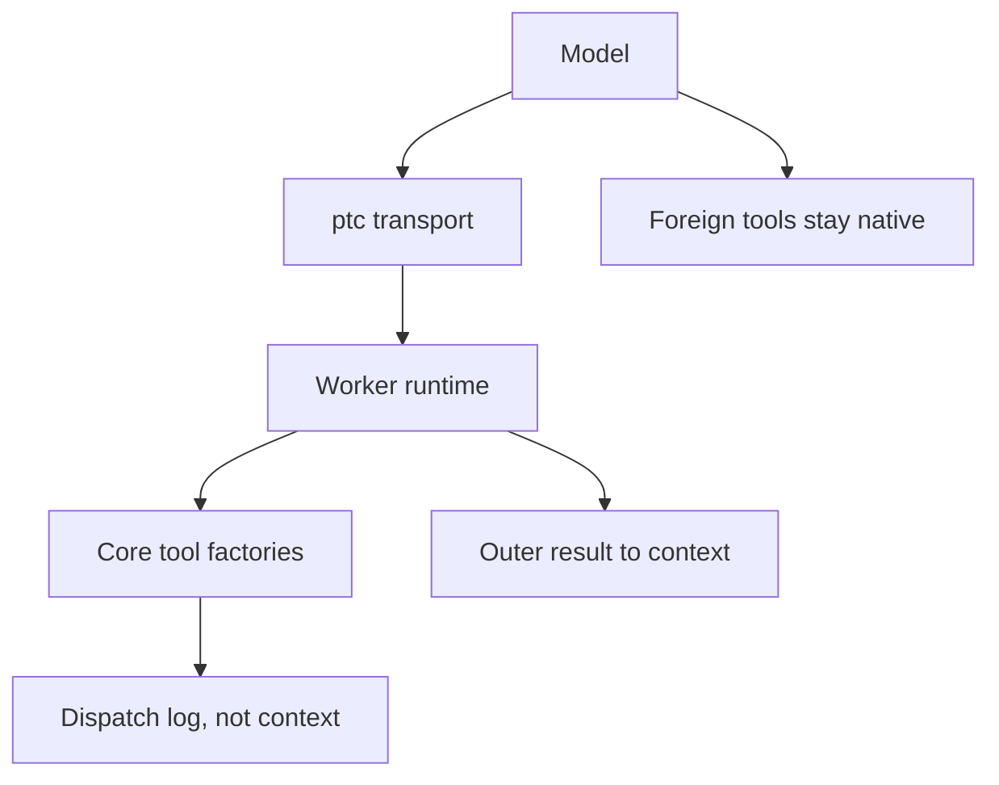

# PTC for Pi

Plan for `pi-ptc`: Programmatic Tool Call as the **default presentation** for
Pi core tools. MCP is out of v1.

Repo is empty. This document is the spec + implementation plan. Do not start
code until this plan is accepted.

## What PTC is

Native loop:

```text
model → tool JSON → host → full result into context → model → next tool
```

PTC:

```text
model → one program → many dispatches inside the runtime → compact outer result → model
```

The model writes code. Code calls tools as functions. Loops, branches, and
`Promise.all` stay off the model. Intermediate blobs never enter context.

Industry names for the same idea:

| Name | Owner | Shape |
|---|---|---|
| Code Mode | Cloudflare, then DSH | one transport + generated SDK |
| PTC | Anthropic | Python in a code-exec container |
| CodeMode | pydantic-ai-harness | Monty sandbox, `run_code` |

**DSH is the reference harness.** Three decisions to copy:

1. Presentation belongs to the tool surface (`native` / `code` / `both`), not
   to a later prompt rewrite.
2. The runtime is a seam: it runs a program against named async bindings and
   returns `{ logs, result?, error? }`. It does not know what a tool is.
3. Each binding re-enters the host tool path. The program sees canonical JSON.
   Failures reject as `ToolCallError(toolName, message)`.

DSH sources:

- [Code Mode foundation](https://github.com/deepseek-ai/deepseek-harness/blob/master/.agents/notes/implemented/feature/2026-06-15-code-mode.md)
- [Typed returns](https://github.com/deepseek-ai/deepseek-harness/blob/master/.agents/notes/implemented/feature/2026-07-20-code-mode-typed-tool-returns.md)
- [`code-mode.ts`](https://github.com/deepseek-ai/deepseek-harness/blob/master/packages/core/tools/src/code-mode.ts)

**fx does not have PTC.** vercel-labs/fx `code` is an ACP permission mode
(auto-approve), not a program-over-tools transport. Do not copy it.

## Why own this

Existing Pi packages either:

- hide **all** tools and grow a second runtime (`pi-fabric`, `pi-retype`), or
- wrap MCP only (`mcpScript`, `pi-codemcp`), or
- invent a private capability registry (`pi-eval-kernel`).

We already run `pi-mcp-adapter`. PTC must **not** steal MCP. v1 owns only
core tools. Foreign tools stay native.



## Approaches

### A — DSH-shaped, recommended

TypeScript program. Fresh worker thread. Bindings = 7 core tools via official
Pi factories. Default presentation `code` for those seven. Foreign tools stay
on the wire.

- Matches DSH contracts.
- Keeps adapter / Plannotator / web search as they are.
- Isolation is containment, not a tenant boundary (same trust as `bash`).

### B — Same-process, retype-like

Run the program in-process with Node type-strip. Faster to ship. No isolate.
One hung loop blocks the TUI. Harder to abort. Reject for default-on PTC.

### C — Python / Monty

Closer to Anthropic PTC and `pi-code-tool`. Extra native dep. Worse fit for
Pi's TypeScript extension host. Defer.

**Ship A.**

## Design

### Presentation

Default: `code`.

| Presentation | Model sees |
|---|---|
| `code` (default) | `ptc` + every **foreign** tool. Core tools hidden. |
| `both` | `ptc` + core + foreign |
| `native` | Core + foreign. No `ptc`. |

`/ptc` cycles or sets `on` / `both` / `off`. Persist under
`~/.pi/agent/ptc.json` and `.pi/ptc.json` (project wins). Use
`CONFIG_DIR_NAME`, never hardcode `.pi`.

On `session_start` and after `/ptc`:

1. Record the current active set.
2. `pi.setActiveTools` to the presentation set. Always keep `ptc` when not
   `native`.
3. Never remove a foreign tool we did not hide.

If another extension later calls `setActiveTools`, re-assert on `turn_start`.
If `ptc` is missing from the registry, fail closed: restore core tools and
notify.

Under `code`, a leaked native core call is blocked in `tool_call`:

```text
only `ptc` may call core tools — use tools.<name>(args) inside a ptc program
```

Do not execute it. Do not treat this as a security boundary; it is
presentation enforcement.

### Transport

Name: `ptc`.

```ts
{
  code: string;         // async function body. top-level await/return legal
  description: string;  // non-empty. UI label only
}
```

Output the model sees:

```ts
{ logs: string[]; result?: JsonValue }
```

`undefined` return omits `result`. `null` is a real result. Cap the serialized
outer payload at 250 KiB / 10,000 lines. Oversized outer result
is an explicit error, not a silent string truncation. Intermediate binding
values are not capped.

### SDK (prompt, not a compiler)

Inject a deterministic `tools:sdk` section via `before_agent_start`.
Lexicographic tool order. Byte-stable for cache.

v1 surface is fixed (no MCP, no dynamic extension discovery):

```ts
await tools.read({ path, offset?, limit? })
await tools.bash({ command, timeout? })
await tools.edit({ path, edits })
await tools.write({ path, content })
await tools.grep({ pattern, path?, glob?, ignoreCase?, literal?, context?, limit? })
await tools.find({ pattern, path?, limit? })
await tools.ls({ path?, limit? })
```

Types are advisory. Runtime type-strips. Programs may use `Promise.all` for
parallel-class bindings only.

Canonical values (program-visible, not rendered cards):

| Binding | Success value |
|---|---|
| `read` | `{ text: string, ...details }` |
| `bash` | `{ output: string, exitCode: number, ...details }` |
| `edit` / `write` | `{ ok: true, ...details }` |
| `grep` / `find` / `ls` | structured details + text |

Failed dispatch rejects `ToolCallError`. No success/failure union.

Also tell the model: load skills with `tools.read`, not native `read`.
`/skill:name` still works. Verify at smoke time whether hiding `read` drops
Pi's skill catalog; if it does, restore the catalog from
`systemPromptOptions.skills`.

### Runtime seam

```ts
run(request: {
  program: string;
  bindings: { global: "tools"; functions: Record<string, BindingFn> };
  signal: AbortSignal;
}): Promise<{ logs: string[]; result?: JsonValue; error?: CodeRunFailure }>
```

Provider: one fresh `worker_threads.Worker` per run.

- Host type-strips erasable TypeScript (Node 22+).
- Program is the body of an async function. Top-level `await` / `return` work.
- Bindings cross a message port as lossless JSON only.
- `undefined`, `NaN`, `Infinity`, `-0`, BigInt, cycles, functions reject that
  one dispatch.
- Empty worker env. Heap / time / output caps as named constants.
- `worker.terminate()` on abort, timeout, or settle.
- Runtime knows nothing about Pi.

Trust: **bash-equivalent containment, not a sandbox.** Say this in the tool
description and README. No "safe eval" claim.

### Dispatch bridge

Host side of each `tools.name(args)`:

1. Snapshot args as lossless JSON.
2. Classify: parallel (`read`, `grep`, `find`, `ls`) or exclusive
   (`bash`, `edit`, `write`).
3. Start in submission order. Parallel may overlap up to
   `MAX_PARALLEL_DISPATCHES` (10). Exclusive drains the pool and runs alone.
4. Execute through official factories:
   `createReadTool`, `createBashTool`, `createEditTool`, `createWriteTool`,
   `createGrepTool`, `createFindTool`, `createLsTool`.
5. Pass cwd, abort signal, and session env the same way Pi does.
6. Return canonical JSON to the worker. Rendered `content` stays on the host.
7. Append a dispatch-log custom entry (`customType: "ptc-dispatch"`). Not
   model-visible.

**Honest gap vs DSH:** Pi 0.84 has no `invokeTool`. Factory execute does
**not** fire other extensions' `tool_call` / `tool_result` handlers. Nested
core work therefore skips permission-extension preflight.

v1 mitigation:

- PTC still runs inside the user's OS permissions, same as `bash`.
- Write a `pi.events` channel (`pi-ptc:dispatch`) so cooperating extensions
  can observe.
- Document the gap.
- If Pi later ships a public invoke path, switch the bridge. Do not invent a
  faux AgentSession in v1.

### What stays out of v1

- MCP bindings and mcporter
- Capturing / hiding foreign tools
- REPL state across `ptc` calls
- Python
- Subagents, actors, workflows
- Saved snippets / `save_tool`
- QuickJS / Monty
- Claiming to wrap every registered Pi tool

### Coexistence

| Installed | Rule |
|---|---|
| `pi-mcp-adapter` | Keep `mcp` / `mcpScript` native. Do not hide. |
| `pi-fabric` / `pi-retype` / other code-mode owners | Refuse to take presentation. Notify and stay inert, or require `/ptc off`. Two owners will fight `setActiveTools`. |
| `pi-runline` | Fine. Additive foreign tool. |

On load, if another known owner is present (`fabric_exec`, `retype`,
`execute_tools`, `exec` from those packages), do not hide core tools until the
user explicitly forces PTC.

### Package shape

Follow `@sagmans/pi-stash`:

```text
index.ts                 # re-export
src/index.ts             # extension factory
src/presentation.ts      # setActiveTools + leak block
src/transport.ts         # ptc tool
src/sdk.ts               # prompt SDK text + types
src/runtime.ts           # CodeRuntime interface
src/worker-runtime.ts    # worker_thread provider
src/worker.ts            # worker entry
src/bridge.ts            # scheduler + factories + dispatch log
src/canonical.ts         # factory result → JSON
src/config.ts            # named constants + load/save
src/host.ts              # Pi type seam
test/*.test.ts
CONTEXT.md
docs/ptc-plan.md
README.md
package.json             # name: pi-ptc, keywords pi-package
```

Constants at file top or `config.ts`. No inline magic numbers.

Node `>=22.19.0`. Pi peer `>=0.84.1` (`setActiveTools`, factories).
`@earendil-works/pi-coding-agent` is a peer. typebox peer.

Scripts: `test`, `typecheck`, `check`, `verify` like stash.

### Invariants

1. Under default `code`, the model cannot see core tool schemas.
2. A `ptc` program can only reach the seven core bindings.
3. Only the outer result enters model context.
4. Dispatch logs never enter model context.
5. Foreign tools remain callable natively.
6. Abort of `ptc` aborts in-flight dispatches and terminates the worker.
7. Exclusive dispatches never overlap another dispatch.
8. PTC is not a security boundary.

## Implementation phases

Each phase ends with `npm test` plus a real Pi dogfood listed below.
No phase ships without that dogfood.

### Phase 0 — Package skeleton

`package.json`, tsconfig, biome, LICENSE (already MIT), README stub,
empty extension that registers nothing. `npm run verify` green.

### Phase 1 — Runtime seam, no Pi

Worker runs a program with fake bindings. Tests:

- `return 1 + 1` → `{ result: 2 }`
- `console.log("x"); return null` → logs + `null`
- throw → structured error
- abort / timeout terminates worker
- binding args must be lossless JSON
- `ToolCallError` is instanceof-checkable inside the program

### Phase 2 — Transport + SDK prompt

Register `ptc`. Inject SDK text. Do **not** hide core tools yet.
Dogfood: `pi -e .` and call `ptc` with `return 1`.

### Phase 3 — Core bridge

Wire the seven factories. Scheduler. Canonical values. Dispatch log.
Dogfood: one `ptc` that `Promise.all`s two `read`s, then a `bash`.
Confirm intermediate file bytes do not appear in the next model turn.

### Phase 4 — Default presentation

Hide core tools. Block leaked native core calls. Persist `/ptc`.
Keep foreign tools. Dogfood with `pi-mcp-adapter` installed: `mcp` still
works; `read` is gone from the tool list; skills still load via
`tools.read` or `/skill:`.

### Phase 5 — Polish

Compact TUI for the outer card (description + return preview). Expand
shows program + dispatch log. Status: `ptc: code`. README, SECURITY note,
CHANGELOG.

## Verification

Automated:

```bash
npm ci --ignore-scripts
npm run verify
```

Unit tests own runtime, JSON boundary, scheduler, canonical mapping,
presentation set math, and leak-block copy.

Real dogfood (required, isolated HOME):

```text
1. pi -e /abs/pi-ptc  in a throwaway dir
2. Ask: "read package.json and tsconfig, return both names"
   Expect one ptc call, not two native reads
3. Ask a bash that fails; program catches ToolCallError
4. With adapter: mcp({ }) still works
5. /ptc off restores native read/bash
6. Esc during a long ptc kills the worker
```

Do not dogfood against production home config. Use a disposable
`HOME` / `PI_CODING_AGENT_DIR` like stash smoke.

## Risks

| Risk | Handle |
|---|---|
| Hiding `read` drops skill catalog | Smoke-check. Restore from `systemPromptOptions.skills` if needed. |
| Another code-mode owner fights tools | Detect and stay inert. |
| Factory path skips permission extensions | Document. Event bus. No faux session in v1. |
| Models keep emitting native `read` | Leak-block message names the binding. Prompt says so first. |
| Worker not a sandbox | README + tool description say bash-equivalent. |
| Type-strip rejects `enum` / namespaces | SDK says erasable syntax only. |

## Done when

- Default session: core tools hidden, `ptc` present, foreign tools present.
- One program can read, filter, and bash without a model round-trip between.
- Outer context has only logs + return.
- `/ptc off` restores native core tools.
- Adapter MCP still works.
- Isolated dogfood recorded in the PR / session notes.
